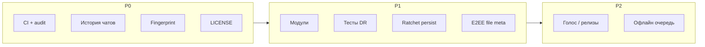

# Рекомендации по развитию VOID (p2p-messenger)

**Дата:** 2026-05-17  
**Охват:** архитектура, безопасность, функциональность, P2P, UX, тестирование.  
**Связанные документы:** [README.md](./README.md), [SECURITY_REVISION.md](./SECURITY_REVISION.md).

---

## Краткий вывод

VOID — зрелый **alpha** по сети и E2EE: libp2p, Noise, Double Ratchet, vault, файлы, NAT traversal. Основные разрывы до «продакшн-ощущения»: отсутствие персистентной истории чатов, нет UX-проверки ключей (MITM), монолитный `main.rs`, слабое тестовое покрытие, нет CI/audit зависимостей, кастомная криптография без внешнего аудита.

---

## Сильные стороны (сохранять)

| Область | Что уже сделано |
|--------|------------------|
| Сеть | TCP/QUIC, Kademlia `/void/kad/1.0.0`, Relay v2, DCUtR, mDNS, bootstrap из нескольких источников |
| Крипто | Только `Encrypted` в чате; `Hello` с Ed25519-привязкой к `PeerId`; лимиты JSON; `zeroize` |
| Хранение | `void.key` (Argon2id + AES-GCM) + `vault.bin`, атомарная запись, `vault.bin.bak` |
| Файлы | Чанки 32 КБ, BLAKE2b, E2EE payload по `/void/chat`, rate-limit на relay |
| UX | egui, контакты, ретрай через DHT, toasts, передача файлов до 512 МБ |

---

## 1. Архитектура и сопровождение кода

### Проблема

Почти вся логика сосредоточена в `src/main.rs` (~4000 строк): сеть, vault, протокол, bootstrap, обработка UI-команд.

### Рекомендации

| # | Действие | Приоритет |
|---|----------|-----------|
| 1.2 | Добавить **CI** (`.github/workflows`): `cargo test`, `cargo clippy`, `cargo fmt --check` | P0 |
| 1.3 | В CI: `cargo audit` и/или `cargo deny` (см. [SECURITY_REVISION.md](./SECURITY_REVISION.md) §7.3) | P0 |
| 1.4 | Добавить файл **`LICENSE`** в корень репозитория | P0 |
| 1.5 | Опционально: единый конфиг `void.toml` (bootstrap, пути, флаги) вместо только env | P2 |
| 1.6 | Обновить или удалить устаревший [analysis_results.md](./analysis_results.md) (plain Hello, libp2p.io relay) | P0 |

---

## 2. Тестирование

### Текущее состояние

- **7** unit-тестов: 1 в `crypto.rs`, 6 в `file_transfer.rs`.
- Нет интеграционных тестов сети, fuzz/property-тестов на парсинг.

### Рекомендации

| # | Действие | Приоритет |
|---|----------|-----------|
| 2.1 | Расширить тесты Double Ratchet: несколько сообщений, out-of-order, шаг DH-ratchet | P1 |
| 2.2 | Property/fuzz: `parse_decrypted_chat_json`, `validate_inbound_file_packet` | P1 |
| 2.3 | Интеграционный тест: два in-memory swarm, Hello → Encrypted → Ack | P2 |
| 2.4 | Регрессионные тесты vault: `format_version`, лимиты полей, миграция `void.key` | P1 |

---

## 3. Безопасность и доверие

Детали контролей и остаточных рисков — в [SECURITY_REVISION.md](./SECURITY_REVISION.md).

| # | Тема | Статус | Рекомендация | Приоритет |
|---|------|--------|--------------|-----------|
| 3.1 | Кастомный Double Ratchet | Высокий риск без аудита | Независимый криптообзор **или** миграция на проверенную библиотеку | P0 (стратегия) |
| 3.2 | MITM при первом контакте | Частично (подпись Hello) | **Safety numbers** / QR-fingerprint X25519 + `PeerId` в UI | P0 |
| 3.3 | Метаданные файлов (`Offer`) | Открыты на `/void/file` | Шифровать оффер в E2EE-слое или минимизировать поля | P1 |
| 3.4 | Пароль в RAM | `String` в egui | Режим «заблокировать vault», `Zeroizing` для полей пароля, таймаут | P1 |
| 3.5 | Зависимости | Не в CI | `cargo audit` / `cargo deny` по расписанию | P0 |
| 3.6 | Верхняя граница JSON file RR | После decode | Лимит размера всего пакета до `serde_json` (опционально) | P2 |

---

## 4. Функциональность

### 4.1 Критичные пробелы

| # | Проблема | Рекомендация | Приоритет |
|---|----------|--------------|-----------|
| 4.1.1 | **История чатов только в RAM** | Зашифрованный локальный журнал (`chat` в vault или отдельный файл), лимит размера, ротация | P0 |
| 4.1.2 | **E2EE-сессии не персистятся** | Сохранение ratchet state в vault (с версией) или явный «сброс сессии» в UI | P1 |
| 4.1.3 | **Глобальный чат отключён**, код остался | Удалить мёртвые ветки (`recipient_id: None`, `GLOBAL`) или вернуть с лимитами/модерацией | P1 |

### 4.2 Из roadmap README

| Фича | Комментарий | Приоритет |
|------|-------------|-----------|
| Голосовые сообщения | Уже в планах README | P2 |
| Группы (MLS / Sender Keys) | Сложно, сильно отличает продукт | P3 |
| Мобильные сборки | egui mobile или отдельный thin client | P3 |
| Подписанные релизы + reproducible builds | Доверие к бинарникам | P2 |

### 4.3 Дополнительные идеи

| # | Фича | Приоритет |
|---|------|-----------|
| 4.3.1 | Офлайн-очередь исходящих с TTL (сейчас `MAX_ATTEMPTS = 2`) | P1 |
| 4.3.2 | Read receipts / «печатает…» (опционально, E2EE) | P2 |
| 4.3.3 | Блокировка контакта | P2 |
| 4.3.4 | Экспорт/импорт vault (бэкап) | P1 |
| 4.3.5 | QR-код для multiaddr | P1 |
| 4.3.6 | Превью изображений в чате | P2 |
| 4.3.7 | Поиск по локальной истории (после 4.1.1) | P2 |
| 4.3.8 | Headless/daemon режим (узел без GUI) | P3 |

---

## 5. Надёжность P2P и UX сети

| # | Улучшение | Приоритет |
|---|-----------|-----------|
| 5.1 | Статус на контакт: direct / relay / disconnected / handshake | P1 |
| 5.2 | Настраиваемые `RESEND_GRACE`, `MAX_ATTEMPTS`, экспоненциальный backoff | P1 |
| 5.3 | Усилить предупреждение при dial по IP без `/p2p/` | P1 |
| 5.4 | Документировать `VOID_DISABLE_MDNS` для недоверенных LAN | P2 |
| 5.5 | Health-check bootstrap seed (Identify / доступность) в UI | P2 |
| 5.6 | Подсказка «поднять свой bootstrap» + ссылка на [bootstrap_node](https://github.com/MarshalV/bootstrap_node) | P2 |

---

## 6. UI и продукт

| # | Улучшение | Приоритет |
|---|-----------|-----------|
| 6.1 | «Заблокировать vault» без выхода из приложения | P1 |
| 6.2 | Смена ника / ротация ключей с понятным UX | P2 |
| 6.3 | i18n (сейчас интерфейс на русском) | P3 |
| 6.4 | Уведомления ОС при свёрнутом окне | P2 |
| 6.5 | Масштаб шрифта / доступность | P3 |

---

## 7. Приоритизированный roadmap

### P0 — доверие и данные (быстрый эффект)

1. CI: `test` + `clippy` + `cargo audit` / `cargo deny`
2. Зашифрованная **история чатов** в локальном хранилище
3. **Fingerprint / safety number** для контактов
4. Файл **LICENSE**
5. Актуализировать или удалить **analysis_results.md**

### P1 — качество и стабильность

1. Рефакторинг: разбить `main.rs` на модули
2. Тесты DR и протокола; тесты vault
3. Персист ratchet state или явный reset сессии
4. E2EE метаданных файловых офферов
5. Офлайн-очередь, экспорт vault, QR multiaddr
6. Статус соединения per-peer, улучшенный ретрай

### P2 — продукт

1. Голосовые сообщения
2. Reproducible builds / подписанные релизы
3. Read receipts, превью, поиск
4. `void.toml`, health-check bootstrap

### P3 — стратегия

1. Внешний криптоаудит или замена DR
2. Группы (MLS)
3. Мобильные сборки
4. Headless-режим

---

## 8. Быстрые победы (минимум кода)

- [ ] GitHub Actions workflow
- [ ] `LICENSE` (MIT / Apache-2.0 / dual)
- [ ] Удалить/обновить `analysis_results.md`
- [ ] Экран «отпечаток ключа» в UI (hex/QR)
- [ ] Документировать в README ссылку на этот файл

---

## 9. Диаграмма приоритетов

---

*При реализации пунктов обновляйте [SECURITY_REVISION.md](./SECURITY_REVISION.md) и README (раздел «Планы»), если меняется протокол или формат vault.*
